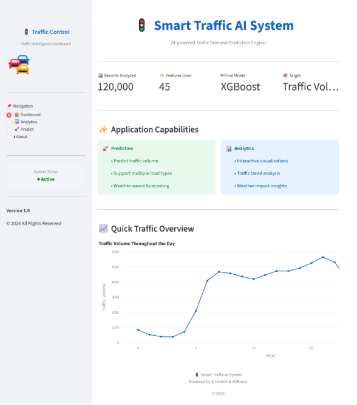
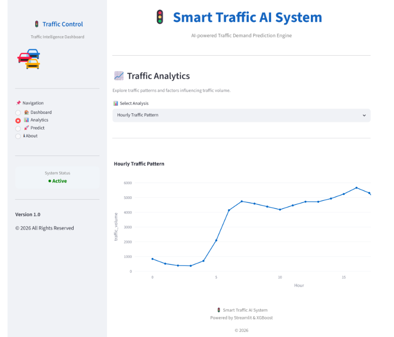
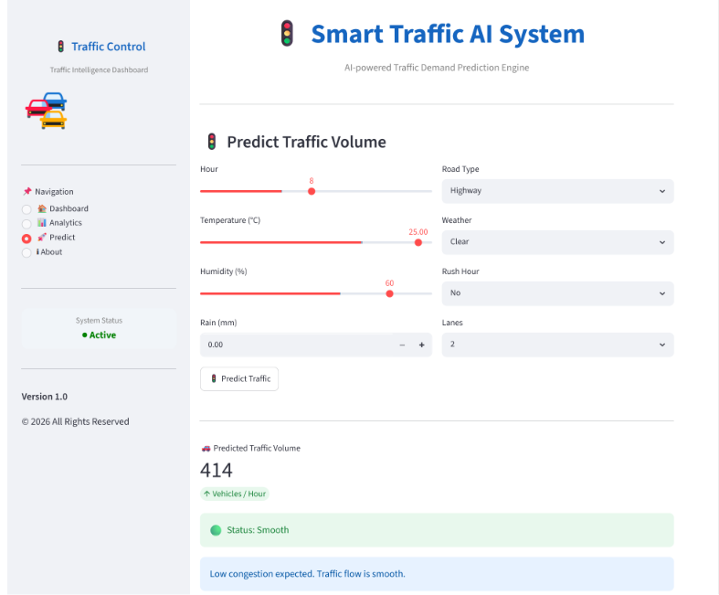
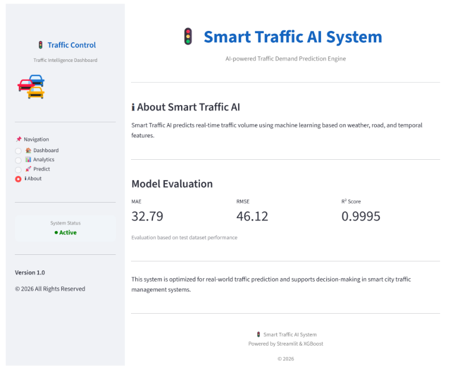

# 🚦 Smart Traffic Demand Prediction System

<p align="center">
  
</p>

<p align="center">
An AI-powered <b>Traffic Demand Prediction System</b> built using <b>XGBoost</b> and <b>Streamlit</b>. The application predicts hourly traffic volume using weather conditions, road characteristics, and temporal features to support intelligent traffic management.
</p>

<p align="center">


</p>

---

# 🌐 Live Application

### 🔗 Streamlit App

**YOUR_STREAMLIT_APP_LINK**

---

# 🎥 Demo Video

### ▶️ Watch Demo

https://drive.google.com/file/d/13mKpZaiRv_Hov47p0WJsRUyRaaMF0VI2/view?usp=sharing

---

# 📄 Project Report

📘 The complete project report is available inside the **reports** folder.

---

# 📸 Application Screenshots

## 🏠 Dashboard


---

## 📊 Analytics Dashboard



---

## 🚦 Traffic Prediction



---

## ℹ️ About Page



---

# 🚀 Key Features

- 🤖 AI-powered Traffic Volume Prediction
- 📈 Interactive Dashboard
- 📊 Real-time Traffic Analytics
- 🌦 Weather-aware Traffic Prediction
- 🚦 Road Type Analysis
- ⏰ Rush Hour Detection
- 📉 Feature Correlation Analysis
- 💻 Streamlit Web Application
- ⚡ Fast XGBoost Prediction Engine

---

# 🛠 Tech Stack

| Category | Technologies |
|-----------|--------------|
| Programming Language | Python |
| Machine Learning | XGBoost Regressor |
| Data Processing | Pandas, NumPy |
| Visualization | Plotly, Matplotlib |
| Web Framework | Streamlit |
| Model Evaluation | Scikit-learn |
| Model Storage | Joblib |

---

# 📈 Machine Learning Workflow

- ✔ Data Collection
- ✔ Data Preprocessing
- ✔ Feature Engineering
- ✔ Exploratory Data Analysis (EDA)
- ✔ Model Training
- ✔ Hyperparameter Tuning
- ✔ Model Evaluation
- ✔ Streamlit Deployment

---

# 🎯 Prediction Features

The model predicts **Traffic Volume** using:

- Hour
- Temperature
- Humidity
- Rainfall
- Snowfall
- Cloud Cover
- Road Type
- Weather Condition
- Number of Lanes
- Rush Hour
- Traffic Signal
- Large Vehicle Count
- Special Event Indicator
- Holiday
- Day
- Month
- Weekend

---

# 📊 Model

| Property | Value |
|----------|--------|
| Algorithm | XGBoost Regressor |
| Prediction Type | Regression |
| Hyperparameter Tuning | RandomizedSearchCV |
| Target | Traffic Volume |

---

# 💻 Installation

Clone the repository

```bash
git clone https://github.com/kondreddyvikhila/traffic-demand-prediction.git
```

Move into the project folder

```bash
cd traffic-demand-prediction
```

Install dependencies

```bash
pip install -r requirements.txt
```

Run the application

```bash
streamlit run app.py
```

---

# 🔮 Future Enhancements

- 🌍 Live Traffic API Integration
- 🗺 Google Maps Integration
- 📱 Mobile Application
- 🚦 Real-time Traffic Monitoring
- 🛣 Route Recommendation System
- 🧠 Deep Learning Models (LSTM)

---

# 👩‍💻 Author

## **Vikhila Kondreddy**

---

If you found this project useful, please consider **starring ⭐ this repository**.

Thank you for visiting this project!
